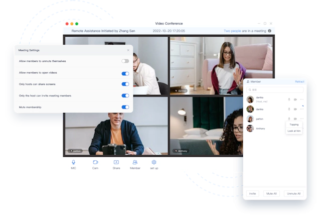

<p align="center">
  <a href="https://openim.io">
    
  </a>
</p>

<h1 align="center">Open Meeting</h1>

<p align="center">
  Actively maintained, community-driven Meeting UI implementation with an <a href="https://github.com/openimsdk/openmeeting-server">openmeeting-server</a>.
</p>

<p align="center">
  <a href="https://www.openim.io/_next/image?url=%2Fimages%2Fmeeting_en.png&w=640&q=100">
    
  </a>
</p>

Open Meeting is a prebuilt component that helps you to build full-featured meeting rooms into your apps easier. And it includes the business logic along with the UI, enabling you to customize your meetingo apps faster with more flexibility. .

* **Free, open-source and community-driven**. We offer no paid plugins and strive to create an easy-to-use, almost drop-in experience for any application. Contributions are more than welcome! Please read our [Contributing Guide](/CONTRIBUTING.md).

* **Supporting server**. We provide our own free and open-source [openmeeting-server](https://github.com/openimsdk/openmeeting-server), which can be used to create a meeting in minutes.

* **Build quickly**. After cloning the code and compiling the project, you can quickly build a complete app.

* **Customizable**. Supports custom themes, locales and more. Check our project for the info. More options are on the way, let us know if something is missing.
  
## Check Out Our Sample Apps

Experience our meeting modules by trying out our sample apps.

**These apps have been created using the same Flutter project.**

| Platform | Link | Remark |
|---------|---------|---------|
| Android/iOS |  | Scan to download app for both Android and iOS. Automatically identifies platform. |
| macOS | Incoming | The macOS version of our sample app.  |
| Windows | Incoming | The Windows version of our sample app, which is a UWP (Universal Windows Platform) application. |

## Getting Started

### Requirements

`Dart >= 3.4.1` and `Flutter = 3.22.1`

See the [example]() project. We use [Getx](https://github.com/jonataslaw/getx) in our project, It is an extra-light and powerful solution for Flutter. It combines high-performance state management, intelligent dependency injection, and route management quickly and practically.

### Deploy server

Deploy the [openmeeting-server](https://github.com/openimsdk/openmeeting-server)

### Build project

Step 1: Update dependencies. 

```ruby
cd open_meeting/
flutter clean
flutter pub get
```

Setp 2: Setup the [server host](/openim_common/lib/src/config.dart).

```dart
// openim_common/lib/src/config.dart
static const _host = "127.0.0.1"; <~ Enter the server address (IP or domain name)
```

Setp 3: Modify metadata

- ##### 1. Place your app’s icon design into the launcher_icon folder and name it app-icon.png，and Excuting an order:

```ruby
flutter pub get
flutter pub run flutter_launcher_icons:main
```

- ##### 2. Replace the app name with what you want.

 ###### Android

```xml
// openim/android/app/src/main/res/AndroidManifest.xm
<application
    android:icon="@mipmap/ic_launcher"
    android:label="your app name" <~ here
    android:requestLegacyExternalStorage="true"
    android:usesCleartextTraffic="true"
    tools:replace="android:label">
</application>
```
  
 ###### iOS/MacOS
  
```xml
// ios/Runner/Info.plist

<key>CFBundleName
</key>
<string>your app name <~ here
</string> 
```

###### Windows
```
// windows/CMakeLists.txt
set(BINARY_NAME "your app name")

```

Step 3: Build binaries

```ruby
// build Android App
flutter build apk

// build iOS App
flutter build ipa

// build MacOS App
flutter build macos
```
Now that you have an installable app, publish it to Google Play and App Store.

## Contributing

OpenMeeting is a fully open-source project, and we welcome contributions. Information on how to get started can be found in [our contributor guide](/CONTRIBUTING.md).

## License

Licensed under the [AGPL-3.0 license](/LICENSE)
